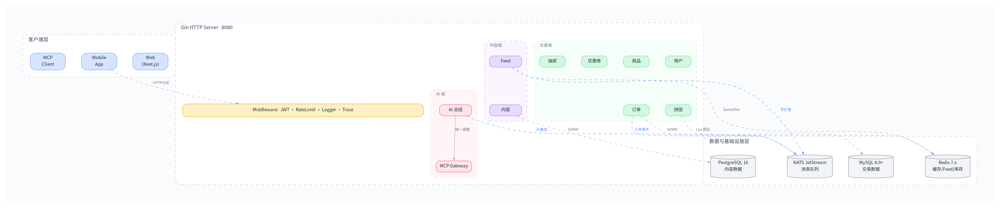
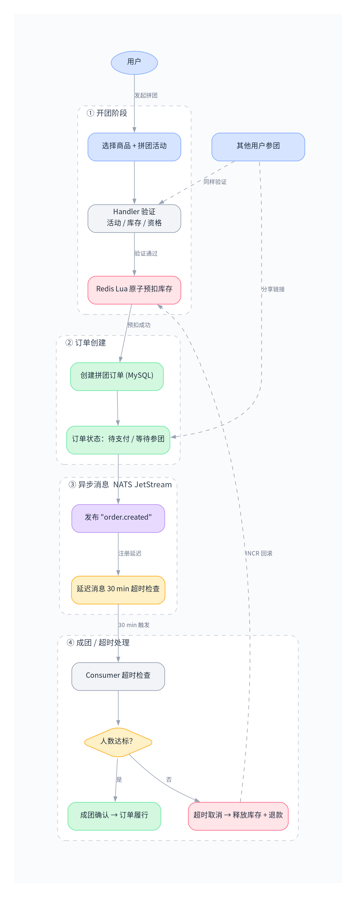
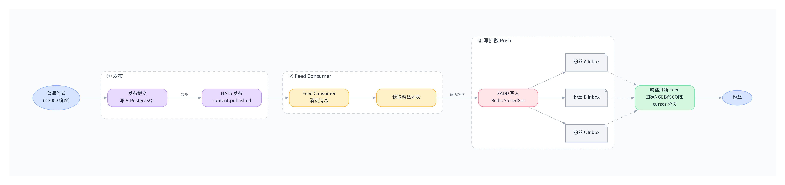
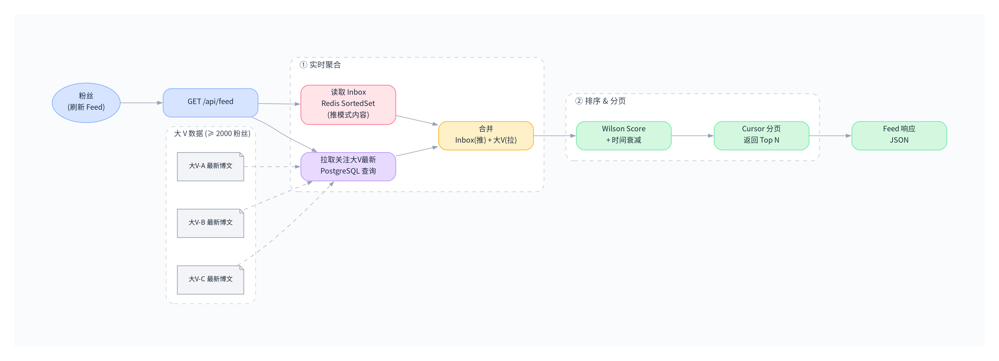
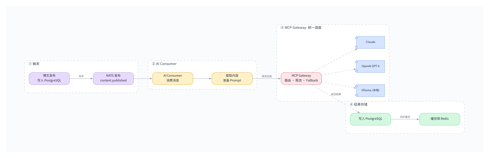
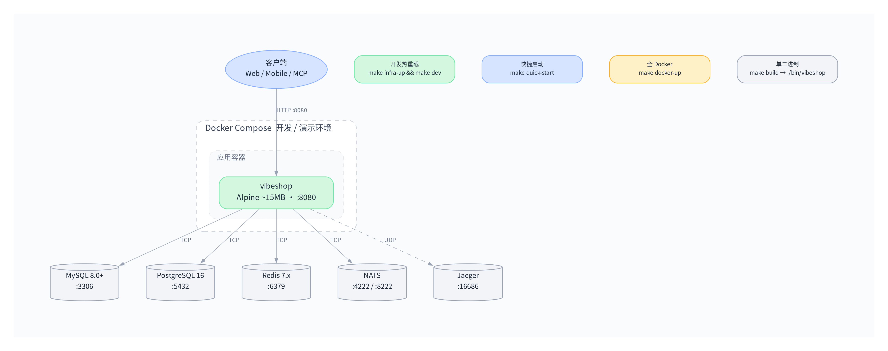

# 系统架构全景图

> 本文档是 VibeShop 系统架构的唯一全景来源。各模块的详细设计见对应 ADR。

---

## 一句话定位

**社交电商 + AI 内容平台**：集拼团购物、博文 Feed 流、AI MCP Gateway 于一体。Go 单体后端（Modular Monolith），模块化设计，未来按需拆服务。

---

## 整体架构图



---

## 模块边界与职责

| 模块 | 包路径 | 数据库 | 核心职责 |
|------|--------|--------|----------|
| 用户 | `internal/module/user/` | MySQL | 注册/登录/JWT/资料/标签/关注 |
| 商品 | `internal/module/product/` | MySQL | SPU/SKU/分类/搜索/库存 |
| 订单 | `internal/module/order/` | MySQL | 下单/支付/退款/状态机 |
| 拼团 | `internal/module/groupbuy/` | MySQL | 开团/参团/成团/超时/退款 |
| 优惠券 | `internal/module/coupon/` | MySQL | 模板/发放/领取/核销/过期 |
| 抽奖 | `internal/module/lottery/` | MySQL | 活动/概率/防刷/兑换 |
| 内容 | `internal/module/content/` | PostgreSQL | 博文 CRUD/标签/评论/搜索 |
| Feed | `internal/module/feed/` | Redis + PG | 推拉分发/排序/游标分页 |
| AI | `internal/module/ai/` | — | 总结/关键词/标题生成 |
| MCP | `internal/module/mcp/` | — | Gateway 路由/限流/SSE/多模型 |

---

## 数据流

### 1. 购物链路（拼团为例）



### 2. Feed 写扩散（普通作者 < 2000 粉丝）



### 3. Feed 读扩散（大 V ≥ 2000 粉丝）



### 4. AI 总结链路



---

## 模块间通信规则

1. **同进程内**：模块间通过 Go interface 调用，不直接 import 具体实现
2. **异步解耦**：需要解耦或可以容忍延迟的操作走 NATS 消息
3. **禁止**：直接跨模块 import 内部 struct，违背模块化原则

```go
// ✅ 正确：通过接口解耦
type StockService interface {
    Deduct(ctx context.Context, skuID string, qty int) error
}

// ❌ 错误：直接 import 另一个模块的内部实现
import "internal/module/product/stock"
```

---

## 关键技术方案摘要

| 方案 | 实现要点 | 详见 |
|------|----------|------|
| 库存预扣 | Redis Lua 原子脚本 + NATS 异步落库 MySQL | [ADR-003](adr/003-redis-unified-cache.md) |
| Feed 推拉 | 粉丝数阈值 2000 分流，Redis SortedSet | [ADR-005](adr/005-feed-push-pull-hybrid.md) |
| 订单超时 | NATS JetStream 延迟投递 | [ADR-004](adr/004-nats-messaging.md) |
| AI 调度 | MCP Gateway 统一路由 + 限流 + fallback | [ADR-006](adr/006-mcp-gateway.md) |
| 分布式锁 | Redis SETNX + 过期时间 | [ADR-003](adr/003-redis-unified-cache.md) |
| 热度排序 | Wilson Score + 时间衰减因子 | [ADR-005](adr/005-feed-push-pull-hybrid.md) |

---

## 部署架构



| 启动方式 | 命令 | 适用场景 |
|----------|------|----------|
| 开发热重载 | `make infra-up && make dev` | 日常开发 |
| 快捷启动 | `make quick-start` | 快速验证 |
| 全 Docker | `make docker-up` | 演示/部署 |
| 单二进制 | `make build && ./bin/vibeshop` | 轻量部署 |

---

*最后更新：2026-05-11*
